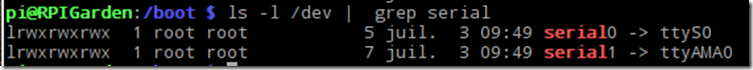
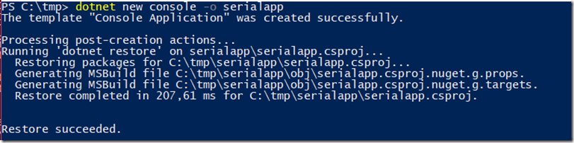
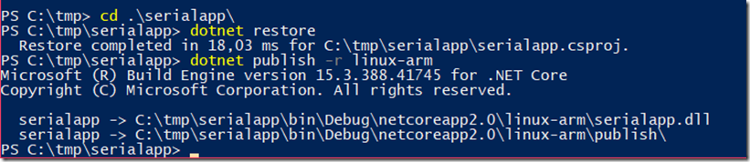
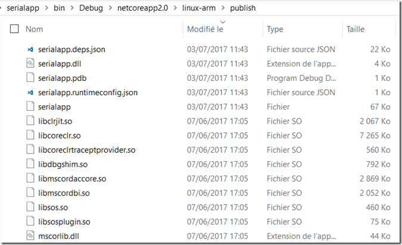
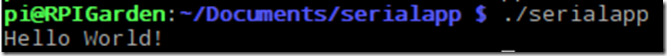
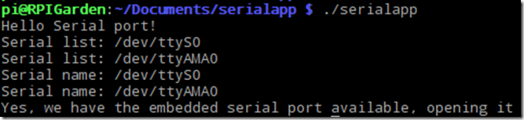
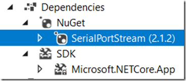
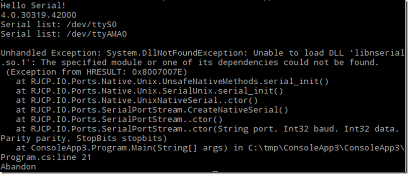
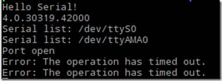

# Using embedded GPIO UART serial port with .NET Core 2.0 on a Raspberry PI 3 running Linux

**Important note** : the date of this article is early June 2017 with an update in Septembre 2017 after the release of .NET Core 2.0. Some technologies described here are in beta, preview or still not fully available. If you read this article later, you may have to do things a bit differently.

I have an arduino connected to a Rapsberry PI 3 running Linux thru the embedded UART. It's the one you access thru the GPIO on physical pins 8 and 10 and logical GPIO14 and GPIO15. I used to access this Arduino for analogic data. I rencently wanted to test .NET Copre 2.0 and see how it can work on a RPI running a Linux ARM architecture. Support for Linux ARM with .NET Core 2.0 is still in preview and quite new.

I realized as well that there is so far, no native support for System.IO.Ports in .NET Core 2.0 for Linux ARM configs. The Windows ARM version is available, still all in preview. So let see what are the steps needed to make anyway all working.
I've split the article in couple of steps which are necessary to have the full project working.

## Step 1: get the Raspberry PI 3 ready for using the embedded serial port

This is a part which I had to spend quite a lot of time because there were some changes between RPI 1/2 and RPI 3 in the embedded serial port. And in the early firmware of the RPI 3 I had, was buggy and it did not allow to work correctly. I finally found answers on GitHub [in the distribution issue list here](https://github.com/RPi-Distro/repo/issues/22 "in the distribution issue list here").
In short, here are the steps you need to follow to activate the serial port.

### Update the firmware

Open a command line and type:
```CMD
sudo rpi-update
```
You'll have to wait for all to be installed, it takes couple of minutes.
Then reboot. Once rebooted, you will have to activate in the boot option the serial port.

### Enabling the UART

For this, you'll have to edit **/boot/cmdline.txt** and **/boot/config.txt**
Open a console, then ```cd /boot``` I usually then use leafpad to edit any config file. I prefer the graphical interface. For this, you'll need admin right to overright config files, so just type ```sudo leafpad```. Open the /boot/cmdline.txt file and remove ```console=ttyS0,115200``` or equivalent. Keep the ```console=tty1```. Save the file.

Then, you'll need to activate the UART per say in the /boot/config.txt file. Open it with the same leafpad administrator session, and add at the end of the file ```enable_uart=1```. Save the file.
Time to reboot. This will now enable the UART and allow you to access it.

**Important note 1**: this procedure is valid only for Raspberry PI 3. It is different on Raspberry PI 1/2. And it is well documented on the web.

**Important note 2**: the embedded UART name is ttyS0 in RPI3 while it was ttyAMA0 on RPI1/2. ttyAMA0 is used for Bluetooth on RPI3.

### Checking all is correct

You can run the following command:
```CMD 
ls –l /dev | grep serial
```


If all is activated, you'll get the 2 serials showing like in the picture above. If it's not what you have then something went wrong. Try again, and check that you've remove the right things from the cmdline.txt file and added the line in the config.txt file.

**Important note 1**: On a RPI1/2, you'll only get 1 serial port mapped on ttyAMA0

**Important note 2**: if you plugged other serial devices on USB port, they'll appear as well in the list

## Step 2: installing .NET Core 2.0 on the Rapsberry

**Important note**: Officially the .NET Core 2.0 is not released while I am writing those lines. And Linux ARM support is still in beta.

In fact, there is nothing special to instal, just dependencies which will be used by the dotnet engine to run the netcore 2.0 application.

### Installing the missing dependencies

I used as a source this [file from GitHub to setup all the .NET Core](https://github.com/dotnet/core/blob/master/samples/RaspberryPiInstructions.md "file from GitHub to setup all the .NET Core") on the RPI3 running Linux. Please refere to this file as I'm sure it will be updated.
In short, you'll have first to add all the needed dependencies. Run the following command from a console:
```CMD
sudo apt-get install libunwind8 libunwind8-dev gettext libicu-dev liblttng-ust-dev libcurl4-openssl-dev libssl-dev uuid-dev unzip
```
Now you should be all good to and all dependencies should be installed for you to run a netcode 2.0 appplication.

## Step 3: installing the .NET Core 2 SDK on a supported platform
My choice goes for Windows. But you can choose any platform. [Instruction for Windows are here](https://www.microsoft.com/net/core/preview#windowscmd "Instruction for Windows are here"). Make sure you install the .NE TCore 2.0. You can as well install daily builds and you can find them [here](https://github.com/dotnet/core/blob/master/daily-builds.md ".NET Core Daily Builds").
You'll find from the same URL the other plateformes like Linux and Mac OS. I've tested MacOS and is does work perfectly as well. Be carreful and follow all instructions as you may have dependency issues. 

## Step 4: creating a simple console app

### Create a simple hello world console app
From a command line (Powershell on Windows for example), go to any directory and create a new project with the following command line: 
```CMD
dotnet new console –o serialapp
```


It will create for you a simple console project. This will allow to test if the all setup is working. Now, let's package this simple hello world app for the Raspberry.
Compile and create the package
Go to the created directory and type ```dotnet restore``` then ```dotnet publish -r linux-arm```



This will create a directory with all the necessary files to be able to run on the Raspberry.



### Deploy the file to the RPI3

Select all the directory and copy it to the RPI. You can use WinCSP, create a share on the RPI, use a stick, anything to copy all the directory to the RPI. In my case, I'm using SMB share.

### Run the app

Now open a console on the RPI, go to the directory you just copy. and type ```./serialapp```
If all goes righ, you should have a "Hello world!"



## Step 5: Serial port support in netcore 2.0

This is where things starts to be quite difficult. So far, there is not support for System.IO.Ports in .NET Core for the Linux ARM platforms. It's only available in preview for the Windows ARM platforms. You can check the long thread discussion on this topic on [GitHub here](https://github.com/dotnet/corefx/issues/984 "GitHub here").

If you want to use the Windows plateform, even for ARM, you can [Nuget](https://dotnet.myget.org/feed/dotnet-core/package/nuget/System.IO.Ports "add this Nuget"). But it will not work for Linux ARM. So what are the solutions?

### Solution 1: the simple wrapper one

This technic is quite simple, I've already used it in the [Rapsberry PI .NET Microframework](https://github.com/Ellerbach/RaspberryPiNETMF "Rapsberry PI .NET Microframework") class compatibility. Idea is to use the ```DLLImport``` feature of .NET. It's already working for .Net Core of course. I found great inspiration and code on [this repo](https://github.com/thinking-home/serial "this repo"). I've simplified the code and made is very straight forward, code available on my [GitHub here](https://github.com/Ellerbach/serialapp "GitHub here").
Import all the functions you need from the native libc. For example the open function.
```C#
[DllImport("libc")]
public static extern int open(string pathname, OpenFlags flags);
```
The way then you can call the imported functions is like any other one:
```C#
// open serial port
int fd = Libc.open(portName, Libc.OpenFlags.O_RDWR | Libc.OpenFlags.O_NONBLOCK);
```
Note that the ```GetPortNames``` functions is checking the /dev/tty* existance for serial ports. On Windows serial ports are all COMx where x is a number, on Linux, they are /dev/tty* where the * can be very different. As in section 1, we know that the embedded serial port for the RPI3 is /dev/ttyS0. So we should find it in the list.

Open a port from the main code is as well quite simple:
```C#
SerialDevice mySer = new SerialDevice("/dev/ttyS0", BaudRate.B1152000);
```
To make this example working, just clone the repo and just use same as previous, ```dotnet restore``` then ```dotnet publish -r linux-arm``` and then copy to the final destination. The code is straight forward, it does raise an event every time a caracter is available. There is no advance ReadLine or equivalent. You can build it on top if you need.
```C#
using System;
namespace serialapp
{
    class Program
    {
        static void Main(string[] args)
        {
            Console.WriteLine("Hello Serial port!");
            var ports = SerialDevice.GetPortNames();
            bool isTTY = false;
            foreach (var prt in ports)
            {
                Console.WriteLine($"Serial name: {prt}");
                if (prt.Contains("ttyS0"))
                {
                    isTTY = true;
                }
            }
            if (!isTTY)
            {
                Console.WriteLine("No ttyS0 serial port!");
                return;
            }
            Console.WriteLine("Yes, we have the embedded serial port available, opening it");
            SerialDevice mySer = new SerialDevice("/dev/ttyS0", BaudRate.B1152000);
            mySer.DataReceived += MySer_DataReceived;
            mySer.Open();
            while (!Console.KeyAvailable)
                ;
            mySer.Close();
        }
        private static void MySer_DataReceived(object arg1, byte[] arg2)
        {
            Console.WriteLine($"Received: {System.Text.Encoding.UTF8.GetString(arg2)}");
        }
    }
}
```
Running the sample will give you this:



and then, you'll get the serial inputs everytime caracters are coming. Note that it's a very basic sample, it will work correctly with a text serial communicaiton as it is using ```System.Text.Encoding.UTF8.GetString``` to convert the byte array into a string.

### Solution 2: the advance solution with more compatibility with original System.IO.Ports

I wanted to see how advanced I can go with closer implementation to System.IO.Ports. I found a library that is quite widely used called [SerialPortStream](https://github.com/Efferent-Health/SerialPortStream "SerialPortStream") and does support Mono as well as .NET Standard. This library is available as a nuget that you can add to your solution. You can use the same created solution as before with the console or create a new one. In this case, I've used the Visua Studio 2017 15.3 Preview 3. I've create a .NET Core 2.0 console app, searched for the nuget and add it:



Name space is ```using RJCP.IO.Ports;```
And the main serial port object is SerialPortStream. It has almost the same properties as in system.IO.Ports. And it's the reason why I've decided to use this one as a temporary solution before an official support for the Linux ARM architecture.
Main difference I found is in the SerialPortStream creation, parity and databits are inverted compare to the traditional SerialPort. For the rest, usage is very simple like for the System.IO.Ports.
```C#
using System;
using System.Collections.Generic;
using RJCP.IO.Ports;
namespace serialapp
{
    class Program
    {
    static void Main(string[] args)
    {
        SerialPortStream myPort = null;
        Console.WriteLine("Hello Serial!");
        Console.WriteLine(Environment.Version.ToString());
        string[] ports = GetPortNames();
        foreach (var port in ports)
            if (port == "/dev/ttyS0")
            {
                myPort = new SerialPortStream("/dev/ttyS0", 115200, 8, Parity.None, StopBits.One);
                myPort.Open();
                if (!myPort.IsOpen)
                {
                    Console.WriteLine("Error opening serial port");
                    return;
                }
                Console.WriteLine("Port open");
            }
        if (myPort == null)
        {
            Console.WriteLine("No serial port /dev/ttyS0");
            return;
        }
        myPort.Handshake = Handshake.None;
        myPort.ReadTimeout = 10000;
        myPort.NewLine = "\r\n";

        while (!Console.KeyAvailable)
        {
            try
            {
                string readed = myPort.ReadLine();
                Console.Write(readed);
            }
            catch (Exception ex)
            {
                Console.WriteLine($"Error: {ex.Message}");
            }

        }
    }
    public static string[] GetPortNames()
    {
        int p = (int)Environment.OSVersion.Platform;
        List serial_ports = new List();

        // Are we on Unix?
        if (p == 4 || p == 128 || p == 6)
        {
            string[] ttys = System.IO.Directory.GetFiles("/dev/", "tty\*");
            foreach (string dev in ttys)
            {
                if (dev.StartsWith("/dev/ttyS") || dev.StartsWith("/dev/ttyUSB") || dev.StartsWith("/dev/ttyACM") || dev.StartsWith("/dev/ttyAMA"))
                {
                    serial_ports.Add(dev);
                    Console.WriteLine("Serial list: {0}", dev);
                }
            }
        }
        return serial_ports.ToArray();
    }
}
}
```
Same as for the privious code, I'm just opening the port. And I'm using the ReadLine function to read up to a carriage return and new line. The GetPortNames function is the same as in the previous example.
Now, you can compile the app with the usal "dotnet restore" then "dotnet publish -r linux-arm" and then deploy it to the device. And then run it. You'll get the following error:



It's normal that you get this error. The nuget package do not carry the necessary Linux serial library. You'll basically will need to compile them. It is documented on the GitHub page. In short:
```CMD
git clone https://github.com/jcurl/serialportstream.git
cd serialportstream/
cd dll/serialunix/
./build.sh
```
If you get an error, you main need to install couple of dependencies like cmake. In this case use ```sudo apt-get install cmake``` or anything similar to add wha tis missing.
Then copy the 3 generated libnserial.so libraries (the .1 and 1.1 as well) which are located in ```serialportstream/dll/serialunix/bin/usr/local/include/lib``` to the same directory as the main code from your .NET Core 2 application. Run it and this time it will perfectly work.



If nothing is plugged to the serial or nothing is sent, then you'll get as well error messages like here the timeout one.

## Conclusion

.NET Core est really a great set of technology and very interesting as it gets more and more support. As always when it comes to using native capabilities of some plateformes, there is the need to write specific code to support each plateformes. Serial ports, USB portas and in general anything related to hardware is specific. But there are always simple ways to integrate things, those are usually simple and efficient for specific projects. Once you want more features and become more compatible, having more performances, you'll need more work.

I'm quite impatient to see how the support for System.IO.Ports will be done in .NET Core 2.0. In the mean time, both solutions are working for me and I'll keep them for some time.
